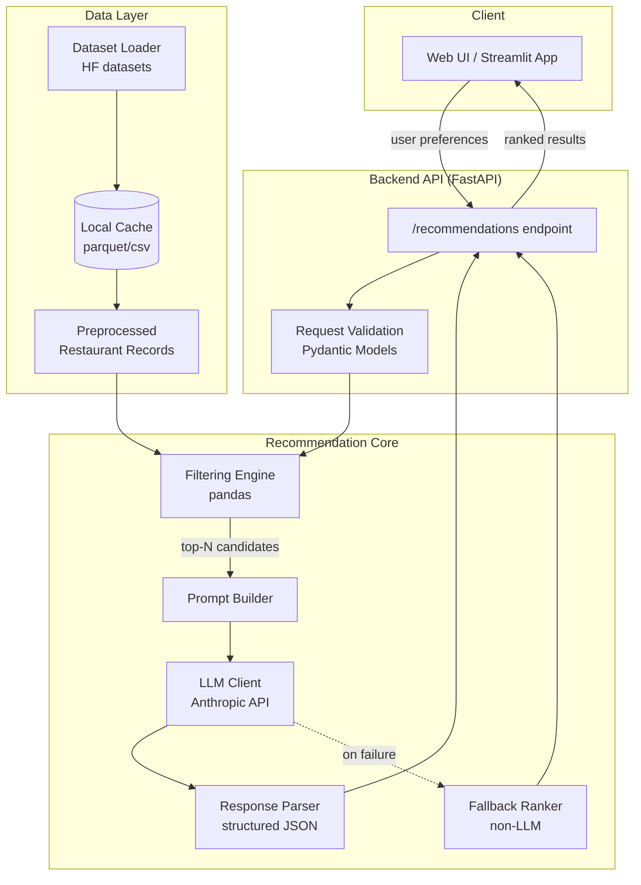
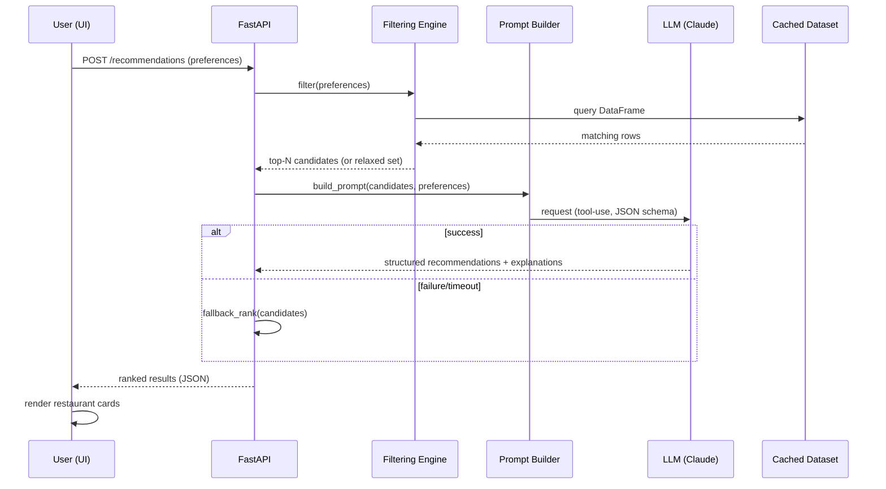

# Architecture: AI-Powered Restaurant Recommendation System

This document defines the technical architecture for the system described in [problemStatement.md](./problemStatement.md). It covers the tech stack, component design, data flow, folder structure, and key engineering decisions needed to implement the Zomato-inspired recommendation service.

## 1. Goals & Constraints Recap

- Combine a **structured dataset** (Zomato restaurants from Hugging Face) with an **LLM** to produce ranked, explained recommendations.
- Inputs: location, budget, cuisine, minimum rating, free-text preferences (e.g., "family-friendly", "quick service").
- Outputs: ranked restaurants with name, cuisine, rating, cost, and an AI-generated explanation.
- Must control LLM cost/latency by pre-filtering with pandas before anything reaches the model, and must degrade gracefully if the LLM call fails.

## 2. High-Level Architecture



## 3. Tech Stack

| Layer | Choice | Rationale |
|---|---|---|
| Language | Python 3.11+ | Best support for `datasets` (Hugging Face), `pandas`, and LLM SDKs |
| Backend API | FastAPI | Async, typed via Pydantic, easy to test and containerize |
| Data ingestion | `datasets` (Hugging Face) + `pandas` | Native HF dataset loading; pandas for filtering/aggregation |
| LLM | Anthropic Claude (`claude-sonnet-5`, fallback `claude-haiku-4-5`) via `anthropic` SDK | Strong reasoning + explanation quality; tool-use for structured JSON output; Haiku fallback for cost-sensitive calls |
| Frontend | Streamlit (MVP) | Fastest path to a usable UI for forms + result cards; can be swapped for React later without touching the core |
| Config/secrets | `pydantic-settings` + `.env` | Centralized, typed config; keeps API keys out of source |
| Testing | `pytest` | Unit tests for filtering logic and prompt construction; mocked LLM responses |
| Packaging | `Docker` + `docker-compose` | Reproducible local/dev environment; separates API and UI containers |

> These are recommendations for a clean MVP, not hard requirements — the core/data layers are framework-agnostic and can be re-hosted behind a different frontend or LLM provider later (see [Section 9](#9-extensibility--future-enhancements)).

## 4. Component Design

### 4.1 Data Ingestion Layer (`data/`)

- **`loader.py`** — Downloads the dataset from Hugging Face (`ManikaSaini/zomato-restaurant-recommendation`) once, caches it locally as a Parquet file (`data/cache/zomato.parquet`). Subsequent runs load from cache unless a `--refresh` flag/env var forces a re-pull.
- **`preprocessor.py`** — Cleans and normalizes raw fields into a consistent schema:
  - Trim/normalize `location` and `city` strings (case-insensitive matching).
  - Split multi-value `cuisine` strings (e.g., `"North Indian, Chinese"`) into a list for containment checks.
  - Parse `cost` into a numeric value and derive a `budget_tier` (`low` / `medium` / `high`) via quantile or fixed thresholds.
  - Coerce `rating` to float; drop or flag rows with missing/invalid ratings.
  - Deduplicate restaurants (same name + location appearing multiple times in raw data).
- **`schema.py`** — Defines the canonical `Restaurant` record (Pydantic model or dataclass) used everywhere downstream: `name, location, cuisines: list[str], cost, budget_tier, rating, extra_attributes`.

### 4.2 API Layer (`api/`)

- **`main.py`** — FastAPI app instance, CORS setup, startup hook that triggers dataset load into an in-memory singleton (avoids re-loading per request).
- **`routes/recommendations.py`** — `POST /recommendations`:
  - Request body: `UserPreferences` (location, budget, cuisine, min_rating, extra_preferences: str).
  - Response body: `RecommendationResponse` (list of ranked restaurants + explanations + optional summary).
- **`models.py`** — Pydantic request/response schemas, decoupled from the internal `Restaurant` record.

### 4.3 Filtering Engine (`core/filter.py`)

- Applies hard filters against the cached DataFrame:
  - `location` (case-insensitive match, optionally fuzzy)
  - `budget_tier` (maps `low/medium/high` to cost ranges)
  - `cuisine` (containment check against the cuisine list)
  - `rating >= min_rating`
- Sorts remaining candidates by `rating desc, cost asc` and truncates to **top 15–20 candidates** before they ever reach the LLM — this bounds prompt size/cost and keeps latency predictable.
- If zero results after filtering, progressively relaxes constraints (drop cuisine, then budget, then rating) and flags the response as "relaxed filters used" so the UI/LLM can be transparent about it.

### 4.4 Prompt Builder (`core/prompt_builder.py`)

- Builds a system prompt establishing the assistant's role ("You are a restaurant recommendation expert...") and output contract.
- Injects the filtered candidate list as compact structured data (JSON) rather than prose, to keep token usage low and make the input unambiguous to the model.
- Includes the user's raw free-text preferences (e.g., "family-friendly") as context the LLM should reason over, since these aren't captured by the hard filters.
- Requests a **structured JSON output** via Claude tool-use/function-calling (not free-form text) so the response is deterministic to parse — schema: `{ recommendations: [{ name, cuisine, rating, cost, explanation }], summary }`.

### 4.5 LLM Client (`core/llm_client.py`)

- Thin wrapper around the `anthropic` SDK: builds the request, attaches the tool schema, handles timeouts/retries (exponential backoff, max 2–3 attempts).
- Model selection is config-driven (`claude-sonnet-5` default, cheaper/faster model swappable via env var).
- On repeated failure or malformed structured output, raises a typed exception that the API layer catches to invoke the fallback path.

### 4.6 Fallback Ranker (`core/fallback.py`)

- Pure-pandas ranking (e.g., weighted score of rating and cost) used when the LLM is unavailable or errors out repeatedly.
- Explanations in this path are template-generated (e.g., "Highly rated {cuisine} option within your budget in {location}") rather than LLM-authored, so the API never returns an empty result to the user.

### 4.7 Frontend (`frontend/`)

- Streamlit app (`app.py`) with a form for location, budget, cuisine, min rating, and a free-text field for extra preferences.
- Calls the FastAPI backend over HTTP; renders results as cards (name, cuisine tags, rating badge, cost, explanation text).
- Shows a non-blocking notice when the backend used the fallback ranker or relaxed filters.

### 4.8 Config (`config.py`)

- `pydantic-settings` `Settings` class reading from `.env`: `ANTHROPIC_API_KEY`, `LLM_MODEL`, `DATASET_NAME`, `CACHE_DIR`, `MAX_CANDIDATES_TO_LLM`, `LOG_LEVEL`.

## 5. Data Flow (Sequence)



## 6. Proposed Folder Structure

```
test-ai-project/
├── docs/
│   ├── problemStatement.md
│   └── architecture.md
├── data/
│   ├── loader.py
│   ├── preprocessor.py
│   ├── schema.py
│   └── cache/                  # gitignored, holds cached parquet
├── core/
│   ├── filter.py
│   ├── prompt_builder.py
│   ├── llm_client.py
│   └── fallback.py
├── api/
│   ├── main.py
│   ├── models.py
│   └── routes/
│       └── recommendations.py
├── frontend/
│   └── app.py
├── tests/
│   ├── test_filter.py
│   ├── test_prompt_builder.py
│   └── test_api.py
├── config.py
├── .env.example
├── requirements.txt
├── Dockerfile
└── docker-compose.yml
```

## 7. Error Handling & Edge Cases

| Scenario | Handling |
|---|---|
| No restaurants match all filters | Progressively relax filters (cuisine → budget → rating); surface which constraints were relaxed |
| LLM API error/timeout | Retry with backoff; after max attempts, use fallback ranker so the user always gets a response |
| LLM returns malformed/non-JSON output | Validate against the tool-use schema; on failure, treat as an LLM error and fall back |
| Missing/dirty dataset fields (null rating, empty cuisine) | Dropped or defaulted during preprocessing; never passed downstream with nulls |
| Dataset unavailable at startup (HF down, first run) | Load from local cache if present; fail startup clearly if no cache and no network |
| Very large candidate set after filtering | Hard cap at top 15–20 by rating/cost before prompt construction |

## 8. Non-Functional Considerations

- **Cost control**: pre-filtering in pandas keeps the LLM prompt small and bounded regardless of dataset size; model choice is configurable to trade quality for cost.
- **Latency**: dataset loaded once into memory at API startup (not per-request); LLM call is the dominant latency cost — consider async/streaming in a later iteration.
- **Testability**: filtering and prompt-building are pure functions over data, testable without any LLM calls; LLM client is mocked in tests via a fixed fake response.
- **Observability**: log filter parameters, candidate count, LLM latency, and whether fallback was used, to make quality issues (e.g., always falling back) visible.

## 9. Extensibility & Future Enhancements

- **Semantic matching**: add embeddings-based search (e.g., for fuzzy cuisine/location matching or free-text preference matching) if keyword/tag filtering proves too rigid.
- **Conversational refinement**: support multi-turn follow-ups ("show me cheaper options") by keeping prior filtered candidates and preferences in session state.
- **Persistence**: add SQLite/Postgres if user history, saved preferences, or feedback loops (thumbs up/down on recommendations) are required.
- **Alternate frontend**: the API is framework-agnostic — Streamlit can be replaced with a React/Next.js frontend without changing `core/` or `data/`.
- **Alternate LLM provider**: `llm_client.py` isolates all Anthropic-specific code, so swapping providers touches one module.
